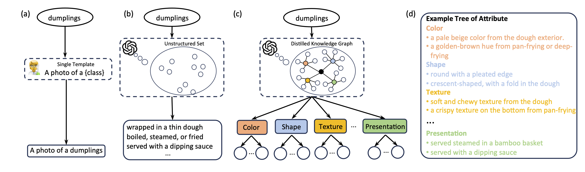

# TAP

Official implementation of our ICLR 2025 paper:

> [**Tree of Attributes Prompt Learning for Vision-Language Models**](https://arxiv.org/abs/2410.11201) <br>
> Tong Ding, Wanhua Li, Zhongqi Miao, Hanspeter Pfister<br>
> In Proceedings of the International Conference on Learning Representation (ICLR 2025)

[](https://arxiv.org/pdf/2410.11201.pdf)

<p align="center">
  
</p>

## Installation

```bash
# Create a conda environment
conda create -y -n tap python=3.9

# Activate the environment
conda activate tap

# Install torch
pip install torch==2.0.0 torchvision==0.15.1 torchaudio==2.0.1


# Install Dassl
git clone https://github.com/KaiyangZhou/Dassl.pytorch.git
cd Dassl.pytorch/
pip install -r requirements.txt
python setup.py develop
cd ..

# Clone TAP code base
git clone https://github.com/HHenryD/TAP
cd TAP
# Install TAP requirements
pip install -r requirements.txt
```

## Dataset

Please follow the [CoOp](https://github.com/KaiyangZhou/CoOp/blob/main/DATASETS.md) repo to prepare the datasets. Set your data directory in the `scripts/base_to_new.sh` file.

## Training and evaluation

```bash
bash scripts/base_to_new.sh
```

## Results

Results reported below show accuracy for base and novel classes for across 11 recognition datasets averaged over 3 seeds.

### TAP in comparison with existing state-of-the-art

| Name                                       | Base Acc. | Novel Acc. |    HM     |
|--------------------------------------------|:---------:|:----------:|:---------:|
| [CLIP](https://arxiv.org/abs/2103.00020)   |   69.34   |   74.22    |   71.70   |
| [CoOp](https://arxiv.org/abs/2109.01134)   |   82.69   |   63.22    |   71.66   |
| [CoCoOp](https://arxiv.org/abs/2203.05557) |   80.47   |   71.69    |   75.83   |
| [ProGrad](https://arxiv.org/abs/2205.14865)  |   82.48 | 70.75 | 76.16   |
| [RPO](https://arxiv.org/abs/2308.14960) | 81.13 | 75.00 | 77.78 |
| [LoGoPrompt](https://chengshiest.github.io/docs/04706.pdf) | 84.47 | 74.24  | 79.03 |
| [PromptSRC](https://arxiv.org/abs/2307.06948) | 84.26 | 76.10  | 79.97 |
| [TAP (ours)](https://arxiv.org/abs/2307.06948) | **84.75** | **77.63**  | **81.04** |

## Acknowledgements

The project was built on top of [CoOP](https://github.com/KaiyangZhou/CoOp) repository. We thank the authors and developers for their contribution.

## Citation

If you find our work useful in your research or if you use parts of this code please consider citing our paper

```bibtex
@inproceedings{ding2025tree,
  title={Tree of Attributes Prompt Learning for Vision-Language Models},
  author={Tong Ding and Wanhua Li and Zhongqi Miao and Hanspeter Pfister},
  booktitle={The Thirteenth International Conference on Learning Representations},
  year={2025}
}
```